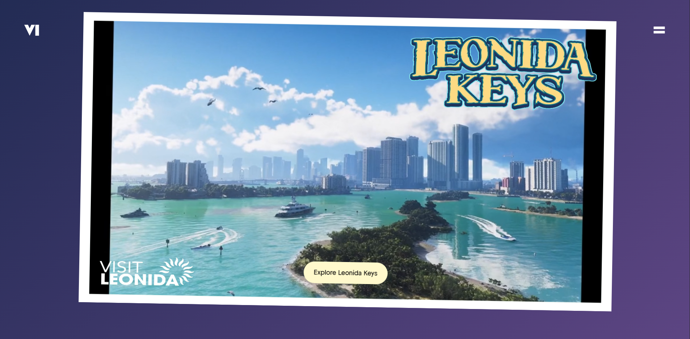
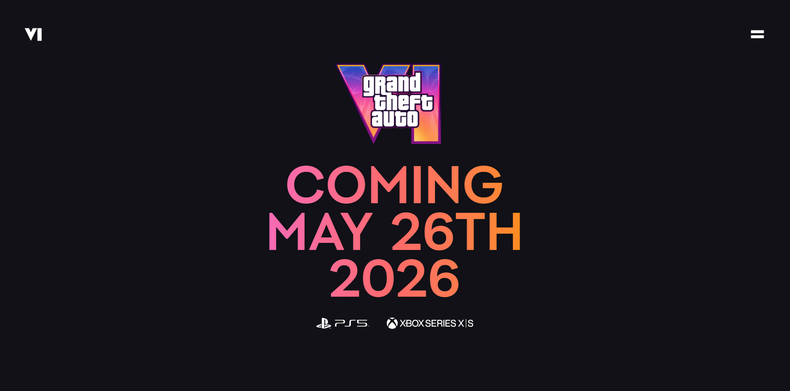

<div align="center">

  

  <h1>🎮 GTA VI Landing Page</h1>

  <p>
    A cinematic, scroll-driven GTA VI fan landing page built with React, GSAP & Tailwind CSS.
    Inspired by the original Rockstar Games reveal — rebuilt from scratch.
  </p>

  <a href="https://gtavi-landingpage-by-krishnacodes17.vercel.app/ " target="_blank">
    
  </a>
  &nbsp;
  <a href="https://github.com/krishnacodes17/GTA_VI_LandingPage" target="_blank">
    
  </a>
  <br/><br/>

  
  
  
  

</div>

---

## 📋 Table of Contents
# Screenshot ✨



1. [About The Project](#-about-the-project)
2. [Features](#-features)
3. [Tech Stack](#-tech-stack)
4. [Getting Started](#-getting-started)
5. [Project Structure](#-project-structure)
6. [What I Learned](#-what-i-learned)
7. [Connect](#-connect)

---

## 🎯 About The Project

This is a **pixel-perfect, scroll-driven recreation** of the GTA VI landing page experience — built entirely from scratch as a GSAP learning project.

Every scroll interaction, video sync, mask reveal, and parallax effect has been hand-crafted using GSAP's ScrollTrigger plugin. The goal was to push the boundaries of what's possible in the browser with pure CSS + JS animations.

> ⚡ Built while learning GSAP — from zero to cinematic.

---

## ✨ Features

| Feature | Description |
|---|---|
| 🎭 **Mask Reveal Animation** | Radial mask that expands on scroll to reveal the hero |
| 📌 **Pinned Sections** | Sections lock in place while animations play out |
| 🎬 **Scroll-Synced Video** | Video `currentTime` driven entirely by scroll position |
| 🌊 **Parallax Effects** | Smooth depth layers that respond to user scroll |
| 💫 **Multi-section Timelines** | Seamless GSAP timelines spanning across sections |
| 📱 **Responsive Design** | Fluid layout and adaptive animations on all screen sizes |
| 🃏 **Animated Postcard** | Interactive card with gradient background and hover effects |

---

## 🛠 Tech Stack

- **[GSAP](https://gsap.com/)** — Animation engine powering all scroll-driven interactions, ScrollTrigger, pinning, and video sync
- **[React](https://react.dev/)** — Component-based architecture with `useGSAP` hook for clean animation lifecycle management
- **[Tailwind CSS](https://tailwindcss.com/)** — Utility-first styling for rapid, consistent UI development
- **[Vite](https://vitejs.dev/)** — Lightning-fast dev server and optimized production builds

---

## 🚀 Getting Started

### Prerequisites

Make sure you have these installed:

- [Node.js](https://nodejs.org/en) (v18+)
- [Git](https://git-scm.com/)
- [npm](https://www.npmjs.com/)

### Installation

```bash
# 1. Clone the repo
git clone https://github.com/krishnacodes17/GTA_VI_LandingPage.git

# 2. Go into the project
cd GTA_VI_LandingPage

# 3. Install dependencies
npm install

# 4. Start the dev server
npm run dev
```

Open [http://localhost:5173](http://localhost:5173) in your browser. 🎉

---

## 📁 Project Structure

```
GTA_VI_LandingPage/
├── public/
│   ├── images/          # All static images & SVGs
│   ├── videos/          # Scroll-synced video files
│   └── fonts/           # Custom GTA-style fonts
├── src/
│   ├── sections/        # Page sections (Hero, Jason, Lucia, etc.)
│   ├── constants/       # Reusable config & mask settings
│   ├── App.jsx          # Root component
│   └── index.css        # Global styles
├── index.html
└── vite.config.js
```

---

## 🧠 What I Learned

Building this project taught me:

- How to use **GSAP ScrollTrigger** — `pin`, `scrub`, `start/end` values
- Syncing **video playback with scroll** using `currentTime`
- Creating **mask reveal effects** with CSS `mask-image` + GSAP
- Managing **animation lifecycles** in React with `useGSAP`
- Deploying a Vite + React app on **Vercel**

---

## 🙌 Connect

Made with 🔥 by **Krishna**

[](https://github.com/krishnacodes17)

---

<div align="center">
  <sub>⭐ If you liked this project, please give it a star on GitHub!</sub>
</div>
